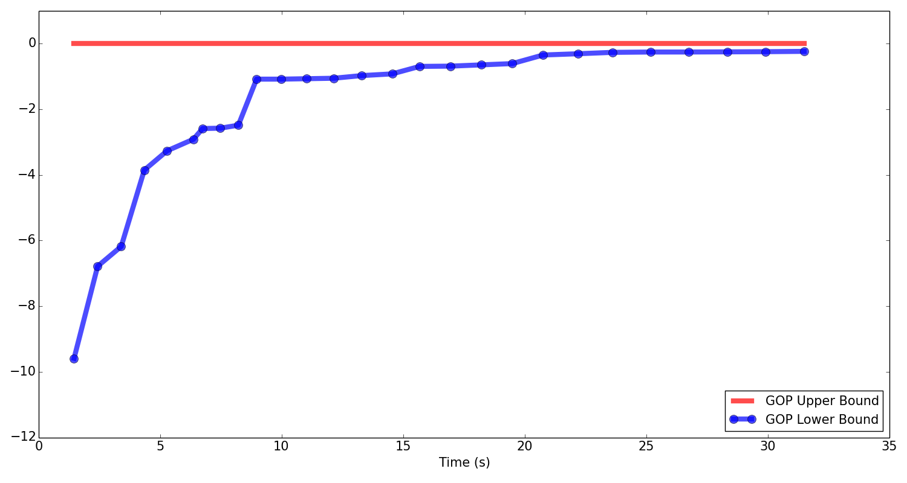
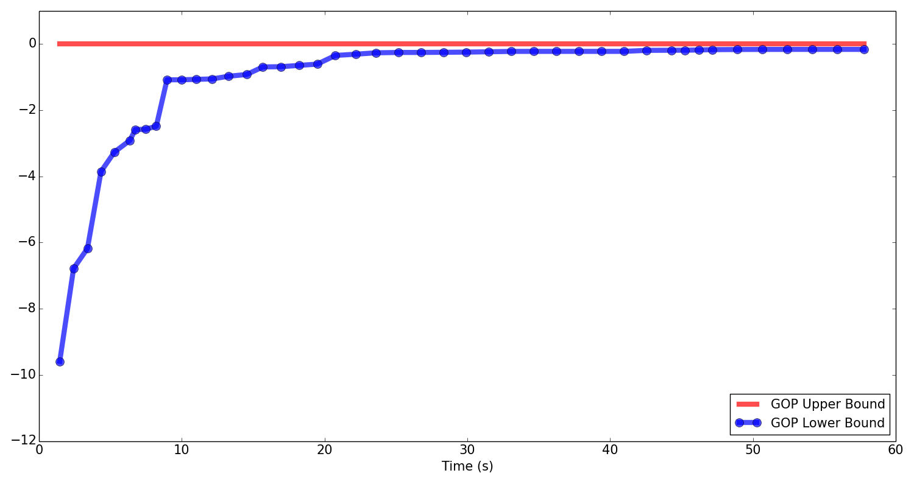
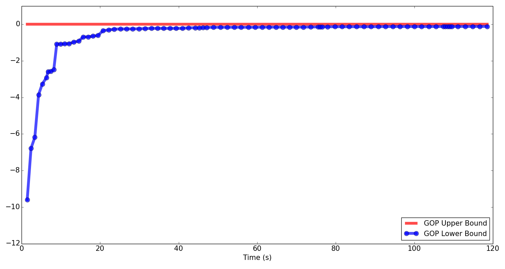
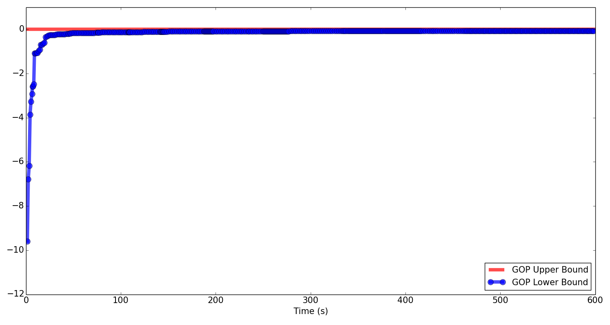
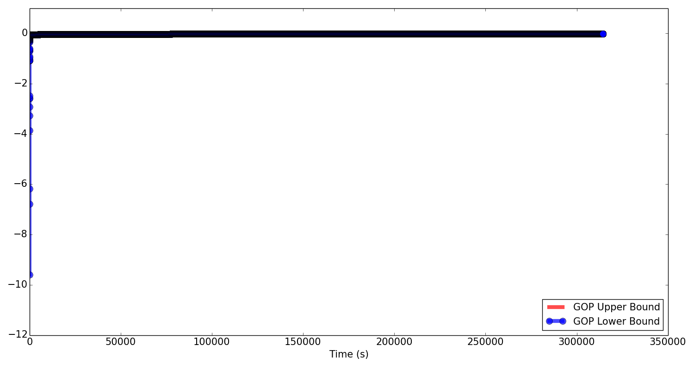

2016-06-06 plot upper lower bounds on running gop
=============================
Purpose
------------
Plot bounds of running gop on a data set of M=1, K=2, and N=10.

Conclusions
-----------------  

The optimal x * optimal theta is very close to true y. 

Background
-----------------

Materials and Equipment
------------------------------

Experimental Protocol
---------------------------
    `python plot_bounds.py`

Results
-----------
	Time used for this iteration: 4.22
	Current bounds: [-0.01, -0.00]
	
	==================Optimal x*theta=================
	[[ 0.5212      0.41766178  0.42267508  0.5212      0.5212      0.5212
	   0.52119999  0.41717842  0.5212      0.5212    ]]
	
	======================Exact y=====================
	[[ 0.5639491   0.41766178  0.42267508  0.540921    0.56226935  0.55709549
	   0.53803598  0.41717842  0.54406061  0.57710487]]
	
	=====================Optimal x====================
	[[ 0.1555  0.5212]]
	
	======================Exact x=====================
	[[ 0.41691577  0.5772031 ]]
	===================Optimal theta==================
	[[  1.05782098e-10   2.83123387e-01   2.69414614e-01   4.98369378e-09
	    1.31541859e-10   2.59346536e-10   1.75554879e-08   2.84445111e-01
	    1.40326509e-09   2.26187169e-11]
	 [  1.00000000e+00   7.16876613e-01   7.30585386e-01   9.99999995e-01
	    1.00000000e+00   1.00000000e+00   9.99999982e-01   7.15554889e-01
	    9.99999999e-01   1.00000000e+00]]
	
	====================Exact theta===================
	[[  8.26890086e-02   9.95345830e-01   9.64068882e-01   2.26356635e-01
	    9.31686368e-02   1.25447313e-01   2.44355681e-01   9.98361378e-01
	    2.06769245e-01   6.12862970e-04]
	 [  9.17310991e-01   4.65417017e-03   3.59311176e-02   7.73643365e-01
	    9.06831363e-01   8.74552687e-01   7.55644319e-01   1.63862220e-03
	    7.93230755e-01   9.99387137e-01]]
	
	All the iterations cost: 314391.87

It cost 87.33 hours.

Archived Samples
-------------------------
M1_K2_N10_SEED0.hdf5

Archived Computer Data
------------------------------

Prepared by: _______Fan Zhang____________ Date: _____2016.06.13______________

Witnessed by: ________________________